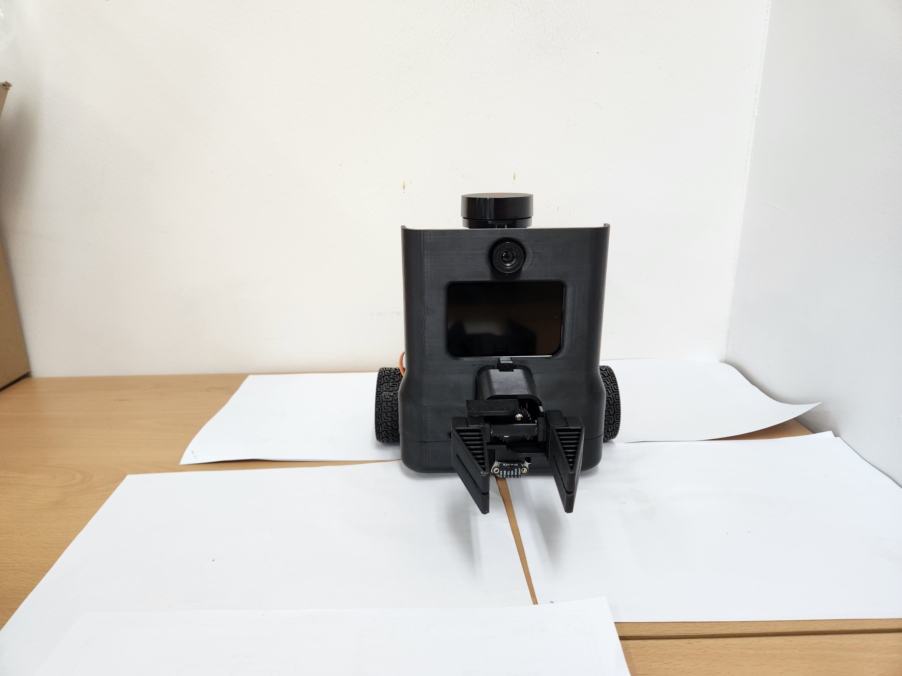
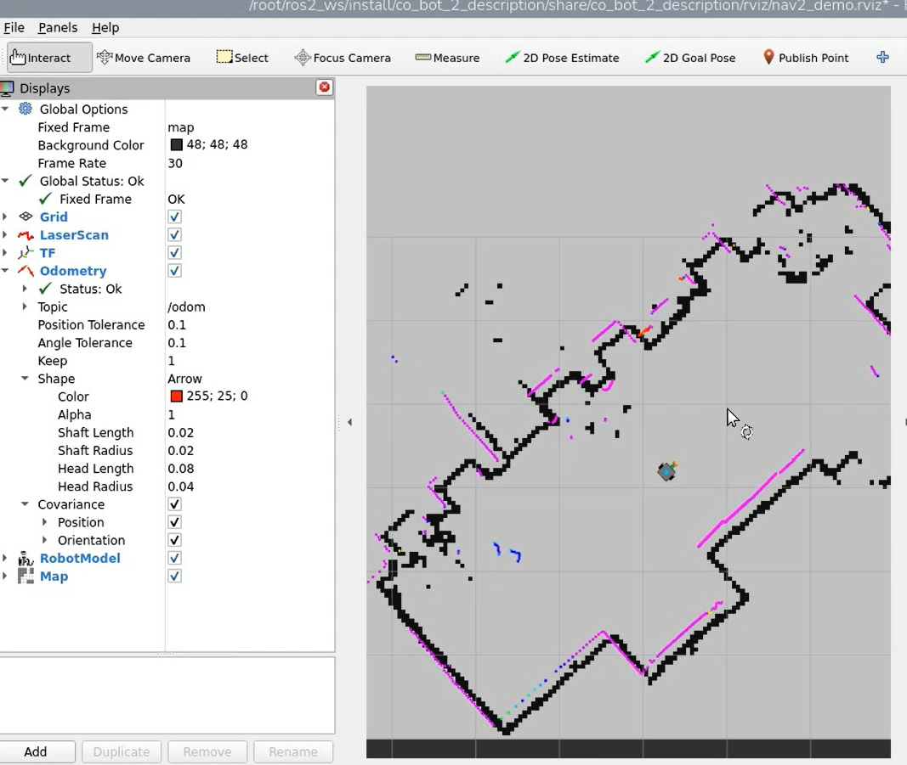
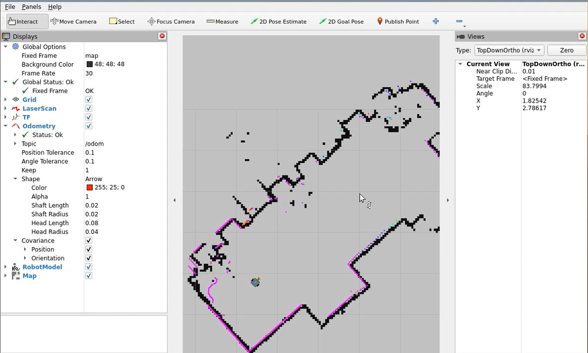
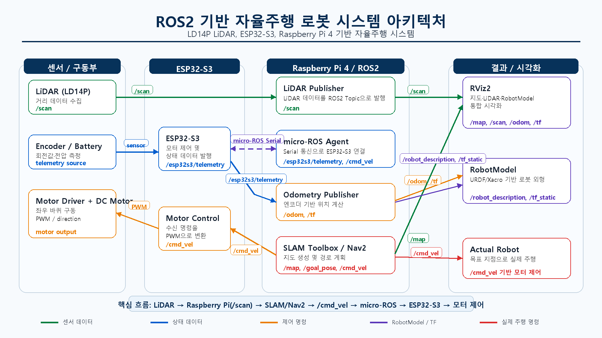

# ROS2 기반 코봇 자율주행 시스템

Raspberry Pi 4와 ESP32-S3를 연결하고, LD14P LiDAR·SLAM Toolbox·Nav2를 이용해 실내 지도 작성과 목표 지점 자율주행을 구현한 이동 로봇 프로젝트입니다.

> 취업 포트폴리오용 공개 저장소입니다. 핵심 ROS2 패키지와 ESP32-S3 펌웨어 일부, 재현용 설정, 시연 결과를 포함합니다.



## 프로젝트 요약

| 항목 | 내용 |
| --- | --- |
| 개발 기간 | 2026.04 ~ 2026.06 |
| 컴퓨팅 | Raspberry Pi 4, ESP32-S3 |
| 센서·구동 | LD14P 2D LiDAR, MPU6050, 엔코더 DC 모터 |
| 미들웨어 | ROS2 Humble, micro-ROS |
| 자율주행 | SLAM Toolbox, Nav2, AMCL |
| 시각화 | RViz2, URDF/Xacro RobotModel |
| 구현 언어 | C++17, Arduino C/C++, Python(검증용) |

## 구현 결과

- ESP32-S3와 Raspberry Pi 사이의 micro-ROS Serial 통신 구성
- `/cmd_vel` 기반 차동구동 모터 제어
- 엔코더·자이로·배터리 데이터를 `/esp32s3/telemetry`로 발행
- LD14P 패킷을 파싱해 `sensor_msgs/LaserScan` 형식의 `/scan` 발행
- 엔코더와 자이로 데이터를 이용한 `/odom`, `/joint_states`, TF 생성
- SLAM Toolbox를 이용한 실내 지도 작성 및 PGM/YAML 저장
- AMCL 위치 추정과 Nav2 경로 계획을 이용한 실제 로봇 목표 주행
- URDF/Xacro와 STL 메시를 이용한 RViz2 RobotModel 시각화

| RViz2 통합 시각화 | Nav2 경로 계획 및 주행 |
| --- | --- |
|  |  |

## 시스템 구성



핵심 데이터 흐름은 다음과 같습니다.

```text
LD14P LiDAR -> lidar_publisher -> /scan -> SLAM Toolbox / Nav2
Nav2 -> /cmd_vel -> micro-ROS Agent -> ESP32-S3 -> Motor Driver
Encoder + MPU6050 + Battery -> /esp32s3/telemetry
                              -> odometry_publisher -> /odom + /tf
```

### 주요 토픽

| 토픽 | 형식 | 역할 |
| --- | --- | --- |
| `/cmd_vel` | `geometry_msgs/Twist` | Nav2 또는 Teleop의 선속도·각속도 명령 |
| `/esp32s3/telemetry` | `std_msgs/Int32MultiArray` | 좌·우 엔코더 위치/속도, Gyro Z, 배터리 전압 |
| `/scan` | `sensor_msgs/LaserScan` | LD14P 거리·강도 데이터 |
| `/odom` | `nav_msgs/Odometry` | 로봇 위치와 속도 추정값 |
| `/map` | `nav_msgs/OccupancyGrid` | SLAM 또는 map server가 제공하는 지도 |
| `/tf`, `/tf_static` | TF2 | `map -> odom -> base_footprint -> base_link -> laser_frame` 관계 |

## 저장소 구조

```text
.
├─ assets/                         # README 및 시연 이미지
├─ docs/
│  └─ portfolio-summary-ko.pdf     # 포트폴리오 요약본
├─ firmware/
│  ├─ esp32s3_telemetry/           # 시연에 사용한 micro-ROS 펌웨어
│  └─ libraries/                   # 모터·엔코더·IMU 사용자 라이브러리
└─ ros2_ws/
   ├─ maps/                        # SLAM으로 생성한 지도
   ├─ scripts/                     # 개별 실행·점검 스크립트
   └─ src/
      ├─ co_bot_2_description/     # URDF, STL, Nav2/RViz, 통합 launch
      ├─ lidar_publisher/          # LD14P 파서와 LaserScan publisher
      └─ odometry_publisher/       # telemetry 기반 Odometry/TF publisher
```

## 실행 환경

- Ubuntu 22.04 / ROS2 Humble
- Raspberry Pi 4
- ESP32-S3 + micro_ros_arduino
- LD14P LiDAR: `/dev/ttyUSB0`, 230400 baud
- micro-ROS Agent: `/dev/serial0`, 115200 baud
- ROS Domain ID: 펌웨어 기본값 `36`

하드웨어 포트와 ROS Domain ID는 환경에 맞게 변경해야 합니다.

## 빌드

```bash
mkdir -p ~/ros2_ws/src
cd ~/ros2_ws/src
git clone https://github.com/koonie404/ros2-cobot-autonomous-navigation.git project

cp -r project/ros2_ws/src/* .
cd ~/ros2_ws

source /opt/ros/humble/setup.bash
rosdep install --from-paths src --ignore-src -r -y
colcon build --symlink-install \
  --packages-select co_bot_2_description lidar_publisher odometry_publisher
source install/setup.bash
```

Nav2, SLAM Toolbox, RViz2, micro-ROS Agent는 시스템에 별도로 설치되어 있어야 합니다.

ESP32-S3 펌웨어는 `firmware/esp32s3_telemetry` 스케치와 `firmware/libraries`의 사용자 라이브러리를 Arduino 라이브러리 경로에 배치한 뒤 빌드합니다. `micro_ros_arduino` 등 외부 라이브러리는 공식 배포본을 별도로 설치해야 합니다.

## 실행

터미널 1 — 로봇 Bringup:

```bash
cd ~/ros2_ws
source /opt/ros/humble/setup.bash
source install/setup.bash
export ROS_DOMAIN_ID=36
ros2 launch co_bot_2_description robot_bringup.launch.py
```

터미널 2 — 저장 지도 기반 Nav2:

```bash
cd ~/ros2_ws
source /opt/ros/humble/setup.bash
source install/setup.bash
export ROS_DOMAIN_ID=36
ros2 launch co_bot_2_description navigation_demo.launch.py \
  map:=$HOME/ros2_ws/src/project/ros2_ws/maps/map.yaml
```

RViz2에서 `2D Pose Estimate`로 초기 위치를 지정한 다음 `2D Goal Pose`로 목표를 설정합니다.

### 상태 확인

```bash
ros2 node list
ros2 topic list
ros2 topic echo /esp32s3/telemetry
ros2 topic echo /scan --once
ros2 topic echo /odom --once
ros2 lifecycle get /bt_navigator
```

## 트러블슈팅

| 문제 | 원인 | 적용한 해결 방법 |
| --- | --- | --- |
| micro-ROS 토픽 미표시 | 호스트와 펌웨어의 Domain ID 불일치 | 양쪽 `ROS_DOMAIN_ID`를 동일하게 설정 |
| Raspberry Pi UART 사용 불가 | GPIO14의 `gpio-fan` 기능과 충돌 | fan 핀 변경 후 `/dev/serial0` 사용 |
| Nav2 BT plugin 로드 실패 | 설치 환경에 없는 plugin 등록 | `navigation.yaml`에서 미사용 plugin 제외 |
| RobotModel TF 경고 | `robot_description`, joint state, RViz 설정 불일치 | Xacro와 `rsp.launch.py`, RViz 설정 수정 |
| 모터 엔코더 핀 간섭 | PCB 하단 핀과 기구물 간 공간 부족 | 3D 프린팅 모터 보강 브래킷 설계 |

## 한계와 확장 계획

- 좁은 공간에서의 경로 추종은 속도·가속도 및 costmap 추가 튜닝이 필요합니다.
- SLAM 지도에는 LiDAR 설치 오차와 환경 변화로 인한 노이즈가 남아 있습니다.
- 카메라, LCD, 그리퍼는 기구 구조까지 반영되었으며 ROS2 제어 연동은 후속 과제입니다.

## 문서

- [프로젝트 포트폴리오 요약본](docs/portfolio-summary-ko.pdf)

## 공개 범위 및 외부 구성요소

이 저장소는 포트폴리오 검토를 위한 핵심 코드 공개본입니다. 빌드 산출물, 로그, 중간 실습 코드, 대용량 영상과 전체 원본 문서는 제외했습니다. Nav2, SLAM Toolbox, micro_ros_arduino 및 기타 외부 라이브러리의 소스는 포함하지 않으며 각 프로젝트의 라이선스를 따릅니다.

별도 라이선스가 명시되지 않은 이 저장소의 사용자 작성 코드와 문서는 포트폴리오 열람용이며, 재사용 전 작성자에게 문의해 주세요.

